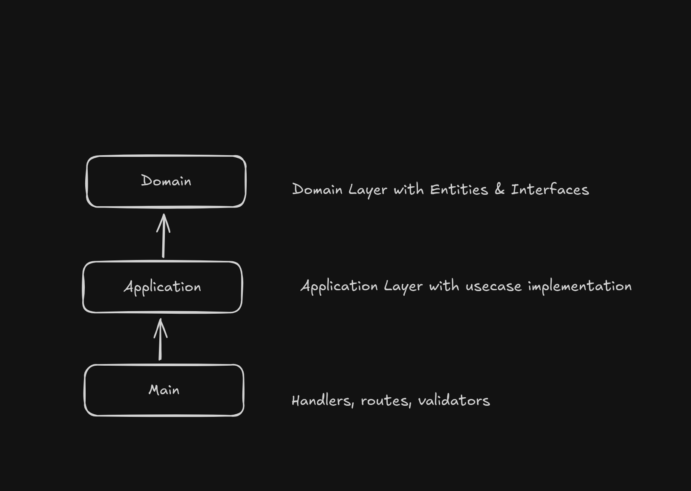

# Insurance Main API Challenge

## Resumo

API de seguros construída com Fastify, TypeScript e Prisma ORM (SQLite). Expõe endpoints para criação de parceiros, cotações e apólices, aplicando integridade referencial no banco e boas práticas de testes de unidade e integração.

## Pré Requisitos

### Obrigatório

- [Docker](https://www.docker.com/)
- [Docker-Compose](https://docs.docker.com/compose/install/linux/)

### Opcional

- [Node (20)](https://nodejs.org/en/)

## Arquitetura do projeto

A arquitetura separa responsabilidades em três camadas: Main expõe handlers, rotas e validadores; Application implementa os casos de uso; Domain contém entidades e interfaces do domínio. Essa divisão reduz acoplamento, facilita testes e evoluções independentes entre interface, lógica de aplicação e modelo de negócio.



## Como executar localmente (DOCKERFILE + DOCKER COMPOSE)

Esse projeto depende de uma api externa, para evitar erros de integração, rode a imagem com docker-compose.

```
docker compose up -d
```

No root do projeto, realize o build da imagem docker da nossa Insurance Main API

```
sudo docker build -t insurance-main-api .
```

Execute a imagem anteriormente construida. Repare que passo algumas variáveis de ambiente, sendo elas as envs da api externa e API_KEY para autorização das rotas(no ambiente produtivo seria informado no CI/CD).

```
docker run --rm -p 3000:3000 -e REQUIRED_API_KEY="b91b548c-9190-41d2-92f2-54f50c839d01" -e INSURANCE_API_KEY="Ea8xNE2q2kRuWqR" -e INSURANCE_API_BASE_URL="http://host.docker.internal:8080" --add-host=host.docker.internal:host-gateway insurance-main-api
```

## Rotas (curls)

**POST /partners**

```bash
curl -d '{"cnpj":"66948199000192","name":"Betty Carter"}' \
  -H 'Content-Type: application/json' \
  -H 'x-api-key: b91b548c-9190-41d2-92f2-54f50c839d01' \
  http://localhost:3000/partners
```

**POST /partners/:partner_id/quotes**

```bash
curl -d '{"age":25,"sex":"m"}' \
  -H 'Content-Type: application/json' \
  -H 'x-api-key: b91b548c-9190-41d2-92f2-54f50c839d01' \
  http://localhost:3000/partners/{{coloque_aqui_partner_id}}/quotes
```

**POST /partners/:partner_id/policies**

```bash
curl -d '{
  "quotation_id":"{{quotation_id criado anteriormente}}",
  "name":"Betty Carter",
  "sex":"m",
  "date_of_birth":"2000-01-19"
}' \
  -H 'Content-Type: application/json' \
  -H 'x-api-key: b91b548c-9190-41d2-92f2-54f50c839d01' \
  http://localhost:3000/partners/{{coloque_aqui_partner_id}}/policies

```

**GET /partners/:partner_id/policies/:policy_id**

```bash
curl -sS -H 'x-api-key: b91b548c-9190-41d2-92f2-54f50c839d01' \
  http://localhost:3000/partners/{{coloque_aqui_partner_id}}/policies/{{coloque_aqui_policy_id}}
```

## Rodando localmente (SEM DOCKERFILE)

Instale todas dependencias

```bash
npm ci
```

Rode o docker compose

```bash
docker-compose up -d
```

Realize o build e execute o servidor http

```bash
npm run build && npm run dev
```

## Testes

Rodar testes unitários

```bash
npm run test
```

Rodar testes unitários+coverage

```bash
npm run test:coverage
```

Rodar testes de integração

```bash
npm run test:integration
```
